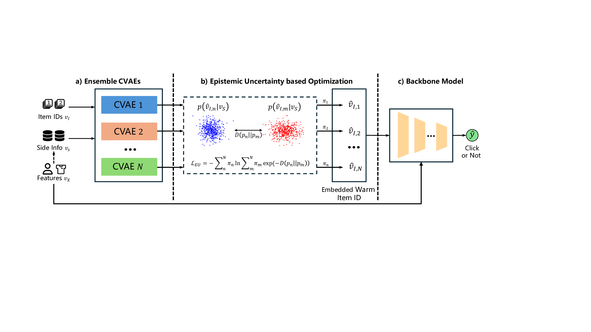

# CREU
This repository is the official implementation of the paper: ***Harnessing Light for Cold-Start Recommendations: Leveraging Epistemic Uncertainty to Enhance Performance in User-Item Interactions*** from CIKM 2025.
## Model

## Requirements
#### The code is tested under the following environment:
```
- Python 3.12
- PyTorch 2.7.1
- numpy 2.2.6
- pandas 2.3.0
- scipy 1.17.0
- scikit-learn 1.7.0
- geomloss 0.2.6
- pykeops 2.3
```
#### Create a conda environment:
```
conda create -n creu python=3.12
conda activate creu

# Default PyTorch version is CPU version, you can change it to GPU version according to your needs
# Comment out the CPU version and uncomment the GPU version in requirements.txt
conda install --yes --file requirements.txt
```
## Dataset
We tested our model on two datasets: [**MovieLens-1M**](http://www.grouplens.org/datasets/movielens/) and [**Taobao Display Ad Click**](https://tianchi.aliyun.com/dataset/56).
### Data Statistics
| Dataset      | #Users | #Items | #Interactions | Sparsity |
|--------------| ------ | ------ | ------------- |----------|
| MovieLens-1M | 6,040 | 3,706 | 1,000,209 | 95.8100% |
| TaobaoAD     | 1,140,000 | 850,000 | 26,550,000 | 99.9973% |
### Preprocessing
The raw data needs to be preprocessed using `movielens1M_preprocess.ipynb` and `taobaoAD_preprocess.ipynb` in the `datahub` folder.
You can download processed data from our OneDrive [[MovieLens-1M](https://1drv.ms/f/c/77b399cedb68edf4/EmCdohBo77hKr6FTEXdLATIBiOHOHVfGj0dmCPGZTibCvQ?e=lc5jTa)|[TaobaoAD](https://1drv.ms/f/c/77b399cedb68edf4/EurZ7UhuL6tBvPb1vjXF364Bve6k4syXNZTTay9vS8Qe_A?e=VxpJWm)]
## Usage
```
python main.py --dataset_name <dataset_name>  --model_name <backbone> --warmup_model <model_name> --creu_iters 10
```
